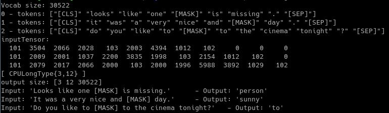

# Transformer [](https://opensource.org/licenses/Apache-2.0)[](https://pkg.go.dev/github.com/sugarme/transformer?tab=doc)[](https://travis-ci.org/sugarme/transformer)[](https://goreportcard.com/report/github.com/sugarme/transformer) 

## Overview

`transformer` is pure Go package to facilitate applying Natural Language Processing (NLP) models train/test and inference in Go. 

This package is in active mode of building and there are many changes ahead. Hence you can use it with your complete own risk. The package will be considered as stable when version 1.0 is released. 

`transformer` is heavily inspired by and based on the popular [Python HuggingFace Transformers](https://github.com/huggingface/transformers). It's also influenced by [Rust version - rust-bert](https://github.com/guillaume-be/rust-bert). In fact, all pre-trained models for Rust are compatible to import to this Go `transformer` package as both `rust-bert`'s dependency Pytorch Rust binding - [**`tch-rs`**](https://github.com/LaurentMazare/tch-rs) and Go binding [**`gotch`**](https://github.com/sugarme/gotch) are built with similar principles. 

`transformer` is part of an ambitious goal (together with [**tokenizer**](https://github.com/sugarme/tokenizer) and [**gotch**](https://github.com/sugarme/gotch)) to bring more AI/deep-learning tools to Gophers so that they can stick to the language they love and good at and build faster software in production. 

## Dependencies

2 main dependencies are:

- `tokenizer`
- `gotch`

## Prerequisites and installation

- As this package depends on `gotch` which is a Pytorch C++ API binding for Go, a pre-compiled Libtorch copy (CPU or GPU) should be installed in your machine. Please see [gotch](https://github.com/sugarme/gotch) installation instruction for detail. 
- Install package: `go get -u github.com/sugarme/transformer`

## Basic example

```go
    import (
        "fmt"
        "log"

        "github.com/sugarme/gotch"
        ts "github.com/sugarme/gotch/tensor"
        "github.com/sugarme/tokenizer"

        "github.com/sugarme/transformer/bert"
    )

    func main() {
        var config *bert.BertConfig = new(bert.BertConfig)
        if err := transformer.LoadConfig(config, "bert-base-uncased", nil); err != nil {
            log.Fatal(err)
        }

        var model *bert.BertForMaskedLM = new(bert.BertForMaskedLM)
        if err := transformer.LoadModel(model, "bert-base-uncased", config, nil, gotch.CPU); err != nil {
            log.Fatal(err)
        }

        var tk *bert.Tokenizer = bert.NewTokenizer()
        if err := tk.Load("bert-base-uncased", nil); err != nil{
            log.Fatal(err)
        }

        sentence1 := "Looks like one [MASK] is missing."
        sentence2 := "It was a very nice and [MASK] day."
        sentence3 := "Do you like to [MASK] to the cinema tonight?"

        var encodings []tokenizer.Encoding
        enc1, err := tk.EncodeSingle(sentence1, true)
        if err != nil {
            log.Fatal(err)
        }
        encodings = append(encodings, *enc1)
        enc2, err := tk.EncodeSingle(sentence2, true)
        if err != nil {
            log.Fatal(err)
        }
        encodings = append(encodings, *enc2)
        enc3, err := tk.EncodeSingle(sentence3, true)
        if err != nil {
            log.Fatal(err)
        }
        encodings = append(encodings, *enc3)

        // Find max length of token Ids from slice of encodings
        var maxLen int = 0
        for _, en := range encodings {
            if len(en.Ids) > maxLen {
                maxLen = len(en.Ids)
            }
        }

        var tensors []ts.Tensor
        for _, en := range encodings {
            var tokInput []int64 = make([]int64, maxLen)
            for i := 0; i < len(en.Ids); i++ {
                tokInput[i] = int64(en.Ids[i])
            }
            tensors = append(tensors, *ts.TensorFrom(tokInput))
        }

        for i := 0; i < len(encodings); i++ {
            fmt.Printf("%v - tokens: %q\n", i, encodings[i].Tokens)
        }

        inputTensor := ts.MustStack(tensors, 0).MustTo(device, true)
        fmt.Println("inputTensor:")
        inputTensor.Print()

        var output *ts.Tensor
        ts.NoGrad(func() {
            output, _, _ = model.ForwardT(inputTensor, ts.None, ts.None, ts.None, ts.None, ts.None, ts.None, false)
        })

        fmt.Printf("output size: %v\n", output.MustSize())

        index1 := output.MustGet(0).MustGet(4).MustShallowClone().MustArgmax([]int64{0}, false, false).Int64Values()[0]
        index2 := output.MustGet(1).MustGet(7).MustArgmax([]int64{0}, false, false).Int64Values()[0]
        index3 := output.MustGet(2).MustGet(4).MustArgmax([]int64{0}, false, false).Int64Values()[0]

        word1, _ := tk.IdToToken(int(index1))
        fmt.Printf("Input: '%v' \t- Output: '%v'\n", sentence1, word1)

        word2, _ := tk.IdToToken(int(index2))
        fmt.Printf("Input: '%v' \t- Output: '%v'\n", sentence2, word2)

        word3, _ := tk.IdToToken(int(index3))
        fmt.Printf("Input: '%v' \t- Output: '%v'\n", sentence3, word3)
    }
```



## Getting Started

- See [pkg.go.dev](https://pkg.go.dev/github.com/sugarme/transformer?tab=doc) for detail APIs 


## License

`transformer` is Apache 2.0 licensed.


## Acknowledgement

- This project has been inspired and used many concepts from [Python HuggingFace Transformers](https://github.com/huggingface/transformers) and [Rust version - rust-bert](https://github.com/guillaume-be/rust-bert). 

- Pre-trained models and configurations are downloaded remotely from HuggingFace. 


